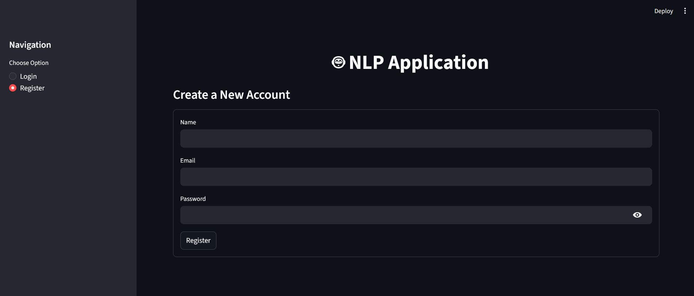
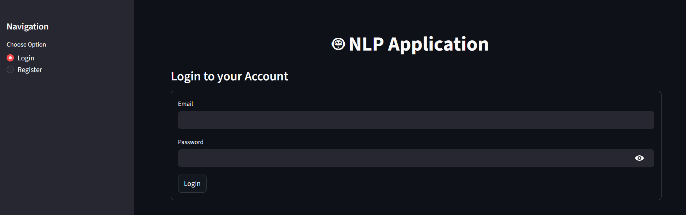
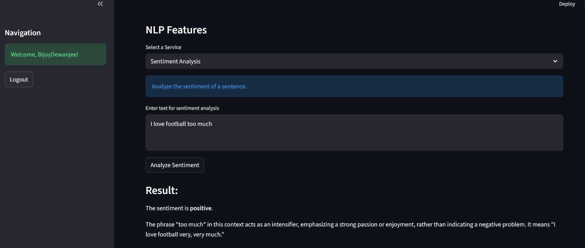
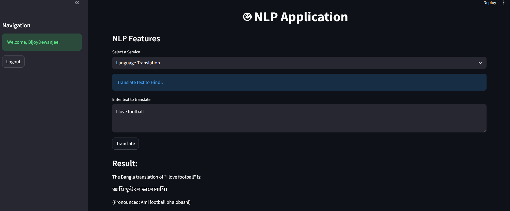
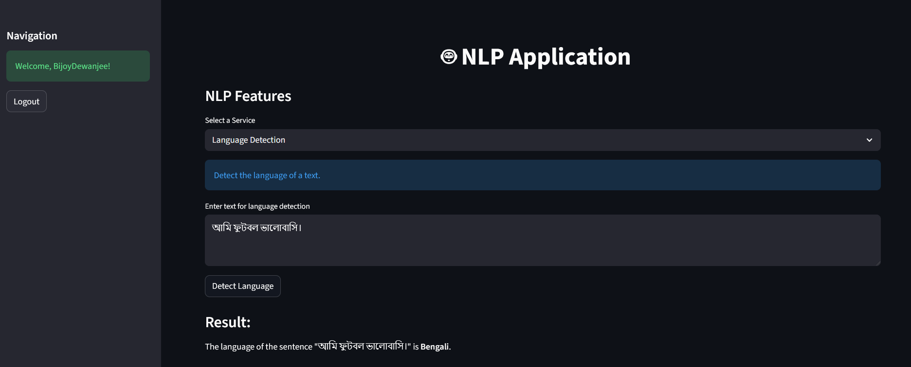

# NLP-APPlication Using OOP + Streamlit + Gemini API

## 📝 Project Description

A simple **NLP Application** built using  **Python** , **Object-Oriented Programming (OOP)** principles,  **Google Gemini API** , and **Streamlit** for the user interface.

This project supports **user authentication** and provides multiple **NLP features** such as sentiment analysis, language translation, and language detection.

## 🧠 Core Features of the Project

### 🔐 1. User Authentication System

* User Registration
* User Login & Logout
* Session-based authentication (Streamlit `session_state`)
* In-memory user database (for demo purposes)

---

### 🧩 2. Object-Oriented Design (OOP Based)

* **BaseModel class** handles AI model configuration
* **AppFeatures class** inherits from BaseModel
* Clear separation of responsibilities
* Promotes **code reusability and maintainability**

---

### 🤖 3. AI-Powered NLP Functionalities

After login, users can choose from the following NLP tasks:

#### ✅ a) Sentiment Analysis

* Analyzes user input text
* Determines whether the sentiment is **positive, negative, or neutral**
* Uses Gemini AI for accurate contextual understanding

Example:

<pre class="overflow-visible! px-0!" data-start="1880" data-end="1943"><div class="contain-inline-size rounded-2xl corner-superellipse/1.1 relative bg-token-sidebar-surface-primary"><div class="sticky top-[calc(--spacing(9)+var(--header-height))] @w-xl/main:top-9"><div class="absolute end-0 bottom-0 flex h-9 items-center pe-2"><div class="bg-token-bg-elevated-secondary text-token-text-secondary flex items-center gap-4 rounded-sm px-2 font-sans text-xs"></div></div></div><div class="overflow-y-auto p-4" dir="ltr"><code class="whitespace-pre!"><span><span>Input</span><span>:</span><span></span><span>I</span><span></span><span>am</span><span></span><span>very</span><span></span><span>happy</span><span></span><span>today</span><span>
</span><span>Output</span><span>:</span><span></span><span>Positive</span><span></span><span>sentiment</span><span>
</span></span></code></div></div></pre>

---

#### 🌐 b) Language Translation

* Translates user-provided text into (English → Bangla)
* Uses AI-based contextual translation instead of word-by-word translation

---

#### 🔍 c) Language Detection

* Automatically detects the language of the given sentence
* Supports multilingual input

---

### 🔄 4. Interactive Menu-Driven Interface

* Easy-to-use command-line menus
* Smooth navigation between features
* Continuous usage without restarting the app

---

### 🔐 5. Secure API Key Management

* Uses `.env` file to store API keys
* Prevents hard-coding sensitive credentials
* Follows industry best practices

## ⚙️ Technologies Used

* **Python 3**
* **Object-Oriented Programming (OOP)**
  * * Inheritance
    * Encapsulation
    * Method overriding
* **Google Gemini AI (Generative Model)**
* **python-dotenv**
* **Environment Variables (.env)**
* **Streamlit** (UI)

## 🧱 Project Architecture (High Level)

    NLP-Application/
│
├── app.py                # Streamlit UI + NLP logic
├── model.py              # BaseModel / NLPModel (Gemini API)
├── .env                  # API key configuration
├── requirements.txt      # Project dependencies
└── README.md             # Project documentation

## 💻 Requirements

* **Python 3.10 or higher**
* **pip** or **conda**
* A valid **Google Gemini API key**

## ▶️ How to Run the Project

* Create a virtual environment:

  ```bash
  conda create -n geminiapp python=3.11 -y
  ```
* Activate virtual environment:

  ```bash
  conda activate geminiapp
  ```
* Install required packages:

  ```bash
  pip install -r requirements.txt
  ```
* Configure Environment Variables:

  Create a `.env` file in the project root directory (`NLP-APP`) and add your Gemini API key:

  ```bash
  GEMINI_API_KEY=your_api_key_here
  ```
* Run the Application:

```bash
  streamlit run app.py
```

### 🔹 UI Logic

* Authentication handled using `st.session_state`
* Sidebar used for navigation
* Main content dynamically changes based on login status

---

## 🔐 Authentication Flow

1. User registers with name, email, and password
2. Credentials stored in session-based database
3. Login validates user credentials
4. Logged-in users can access NLP features
5. Logout clears session state

---

## 🧪 NLP Features Workflow

1. User selects an NLP service
2. Enters text input
3. Gemini API processes the request
4. Output is displayed on UI

---

## 🎯 Learning Outcomes

* Practical understanding of **OOP concepts** (inheritance, encapsulation)
* Hands-on experience with **AI-based NLP**
* Secure API handling using environment variables
* Building scalable, menu-driven Python applications
* Integrating **Generative AI models** into real projects
* Output is displayed on UI

# 📁Images









## 👨‍💻 Author

### **Bijoy Dewanjee**

### 📜 License

This project is open-source and free to use for learning purposes.
